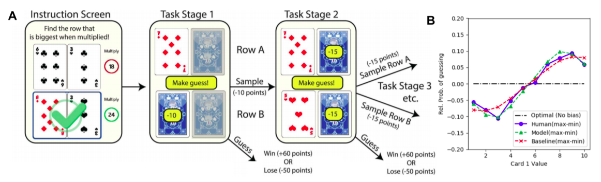

## Model-agnostic Fits for Understanding Information Seeking Patterns in Humans



> [Model-agnostic Fits for Understanding Information Seeking Patterns in Humans](https://arxiv.org/abs/2012.04858)  
> Soumya Chatterjee, Pradeep Shenoy  
> To appear at AAAI 2021

### Abstract
<div align="justify">
In decision making tasks under uncertainty, humans display characteristic biases in seeking, integrating, and acting upon information relevant to the task. Here, we reexamine data from previous carefully designed experiments, collected at scale, that measured and catalogued these biases in aggregate form. We design deep learning models that replicate these biases in aggregate, while also capturing individual variation in behavior. A key finding of our work is that paucity of data collected from each individual subject can be overcome by sampling large numbers of subjects from the population, while still capturing individual differences. In addition, we can predict human behavior with high accuracy without making any assumptions about task goals, reward structure, or individual biases, thus providing a model-agnostic fit to human behavior in the task. Such an approach can sidestep potential limitations in modeler-specified inductive biases, and has implications for computational modeling of human cognitive function in general, and of human-AI interfaces in particular.
</div>

### Requirements
- PyTorch (Tested with version 1.6.0)
- NumPy (Tested with version 1.91.1)
- Pandas (Tested with version 1.1.4)
- tqdm (Tested with version 4.35.0)
- scipy (Tested with version 1.5.2)
- seaborn (Tested with version 0.8.1)

### Data
Download dataset from https://datadryad.org/stash/dataset/doi:10.5061/dryad.nb41c. Create a directory `data` and place the files `TGBE_cardturn_data_54145.mat` and `TGBE_cardturn_data_40686_robbparam.mat` in the `data` directory.

### Code description

- `main.py` has the main code and generates Figures 1b, 4, 5, 6, 7 in the paper. It has the following arguments
```
  -h, --help            show this help message and exit
  --approach_avoid      Use the data with Approach Avoid Parameters
  --tasks TASKS [TASKS ...]
                        IDs of tasks to be used
  --split_frac SPLIT_FRAC
                        Train-val split fraction
  --train_batch_size TRAIN_BATCH_SIZE
                        Training batch size
  --device DEVICE
  --lr LR               Learning rate
  --epochs EPOCHS       Number of training epochs
  --calc_nll            Calculate negative log likelihoods for the model and
                        the baseline
  --all_plots           Show all plots. Default: Only show the plots which are
                        there in the paper
```
- `main.py --calc_nll` gives the negative log likelihood values for the model and the baseline (Figure 3)
- `main.py --approach_avoid` generates Figure 9
- `samp_comp_subject_specific_models.py` generates one data point for Figure 8. Data from multiple runs can be plotted using `samp_comp_plot.py`

__Other Files__:
- `cardenv.py` contains our implementation of the game environment which is used for simulations
- `baseline_model.py` contains the learnt parameters of the baseline model
- `get_dataframe.py` is used to preprocess `*.mat` data files for our code
- `loss.py` contains the loss function
- `networks.py` has the models used in the paper for training and simulations
- `nll_utils.py` is used to calculate negative log likelihoods for Figure 3
- `plot_utils.py` has all the plotting functions
- `sim_utils.py` contains helper functions for simulating the learnt models
- `train_eval_utils.py` has helper functions for training and evaluating the models
- `utils.py` has some general purpose helpers

### Citation:
If you find this helpful, please consider citing:
```
AAAI bibtex coming soon
```
```bibtex
@misc{chatterjee2020modelagnostic,
      title={Model-agnostic Fits for Understanding Information Seeking Patterns in Humans}, 
      author={Soumya Chatterjee and Pradeep Shenoy},
      year={2020},
      eprint={2012.04858},
      archivePrefix={arXiv},
      primaryClass={cs.AI}
}
```